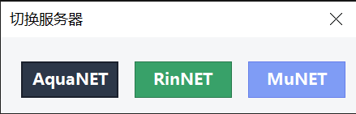

# Playnite 轻松启动中二理科

??? warning "TSD"
    **时效性内容警告**。这意味着该项目可能需要以文档创建时间而非更新时间为参考基准；项目中引用的外部链接随时可能失效。请读者知悉。

??? tip "WIP"
    **在制内容警告**。这意味着该项目含有大量笔者正在测试的技术方法或尚未整理完全的思想理论。请读者知悉。

??? bug "AAA"
    **生成式内容警告**。这意味着该项目含有由 AI/LLM 直接或间接生成的内容。请读者知悉。

本文介绍如何利用 Playnite 一键启动中二理科，并通过其脚本功能实现：

- **弹窗选择**本次游玩连接的模拟服务器（AquaNET / RinNET / MuNET）并自动修改 `segatools.ini`；
- **绕过**游戏内置的凌晨维护时段（02:45–06:00），避免“メンテナンスのため、プレイ受付は終了しています”；
- **静默启动** Brokenithm 服务端，结束后自动清理进程；
- **退出后恢复**系统时间到正确值。

[正篇](#正篇playnite-脚本)所示的三个 Playnite 脚本**缺一不可**，因为部分功能跨脚本协同实现。

> 游戏启动指令设为：`{InstallDir}\bin\start.bat`

本文一切示例基于如下目录结构：

```
└ CHUNITHM
  ├ Brokenithm                     # Brokenithm 服务端工作目录
  │   ├ Brokenithm-Evolved-iOS-Umi.exe  # 服务端主程序
  │   ├ start.vbs                       # 静默启动脚本
  │   └ ...
  └ X-VERSE-X                      # 理科本体（Playnite 中的"游戏安装目录"）
      ├ bin
      │   ├ segatools.ini          # 核心配置文件
      │   ├ TimeTravel.ps1         # 时间穿越脚本
      │   ├ start.bat              # 游戏启动入口
      │   └ ...
      └ data
```
    
!!! warning "警告"
    执行任何配置前，请完全阅读本文内容，理解你正在做什么。

## 前置一：理科

前往 [Evil Leaker 手册](https://manual.evilleaker.com/games/chunithm/setup/) 下载最新版本并遵循教程安装。由于原站不允许转载，这里给出简要流程归档：

1. **安装 Windows 运行时库**（如果后续游戏无法正常运行或你不确定系统环境是否符合游戏要求）：以管理员权限打开 PowerShell，运行 `irm https://get.msvc.win | iex`
2. **提取游戏 HDD（好弟弟）**：用 7z 或系统自带挂载虚拟硬盘功能提取 vhd 文件中的游戏本体到指定路径，路径不要有空格、中文或特殊符号

!!! warning "警告"
    游戏文件不可放置在 `E:\` 和 `Y:\` 盘符下（游戏代码限制）。

3. **覆盖解密文件**：将 `chusanApp.exe` 和 `amdaemon.exe` 放入 `bin` 文件夹。如果后续有版本更新（如可选更新到 2.47 版本）需要在[Evil Leaker 补丁站](https://crew.evilleaker.com/)给新 exe 重新打补丁
4. **安装 option 包**（A001~A251，删除曲补充包 A300）：解压到 `bin\option`，注意不要嵌套（正确路径如 `bin\option\A001\...`）
5. **安装 segatools**：下载 fufubot segatools，将所有文件复制到 `bin`
6. **安装 ICF**：将 `ICF1` 和 `ICF2` 放入 `bin\amfs`

> 游戏版本：CHUNITHM X-VERSE-X (Version 2.45 → 2.47)
> 游戏路径建议添加到 Windows Defender 排除项，可大幅加快启动自检速度
> 音频设备必须使用 `48000Hz` 才能正确播放游戏声音

## 前置二：模拟服务器

中二需要 ALL.NET 实现联网功能。以下介绍三个公开模拟服务器。

### AquaNET

- DNS：`aime.my-aqua.net`（备用：`ea.msm.moe`）
- **使用心得**：功能较完善，网页体验好，支持给企鹅换装、自定义称号。**不能解锁未获取的收藏品**。
- [keychip 注册](https://aqua.msm.moe/general/machine)

### RinNET

- DNS：`aqua.naominet.live`
- 支持游戏：O.N.G.E.K.I. Re:Fresh、CHUNITHM NEWVerse、Maimai DX Prism Plus（全力支持）；Card Maker、CHUNITHM Paradise Lost、Project DIVA Arcade Future Tone（有限支持）

> 官方声明：
> “我们不限制玩家下载/上传/修改自己的游戏档案，随意刷取所需道具，但手动修改游戏档案造成数据损坏时项目组概不负责，在修改时务必备份原档。另外，影响排行榜的行为可能会受到封禁。”

- **使用心得**：可以用来编辑解锁收藏品后导出数据，然后导入 Aqua（Aqua 不支持解锁收藏品）。**不能自定义队伍名字**。目前已支持全国对战。
- [keychip 注册](https://portal.naominet.live/keychip)

### MuNET

- DNS：`play.mumur.net`，AimeDB：`aime.mumur.net`
- [注册并登录](https://portal.mumur.net/)后按网页提示配置即可。

### 配置 segatools.ini

编辑 `bin\segatools.ini` 的 `[dns]` 和 `[keychip]` 段落。**建议先写好三个服务器的配置，将要用的取消注释，备用的保持注释状态**：

```ini
[dns]
; --- AquaNET ---
default=aime.my-aqua.net
; --- RinNET ---
;default=aqua.naominet.live
; --- MuNET ---
;default=play.mumur.net
;AimeDB=aime.mumur.net

[keychip]
; --- AquaNET ---
id=A???-00000000000
; --- RinNET ---
;id=A???-00000000000
; --- MuNET ---
;id=A???-00000000000
```

!!! note "注意"
    **编辑 segatools.ini 时应当只修改相关键值**，或参考 [Unreal Network 教程](https://unreal-network.tech/docs/arcade/segatools/) 操作。不要使用 Word/WPS 等富文本编辑器。keychip 格式：`A000-01234567890`。

下文的“启动前脚本”可以根据你的选择自动注释/取消注释对应行来切换服务器。

## 前置三：Brokenithm

Brokenithm 是一款将 iOS 设备变为中二手台的软件，让你用 iPad/iPhone 的触摸屏代替手台。

### iOS 客户端

[AppStore 链接](https://apps.apple.com/us/app/brokenithm-panel/id6759626539)。

### PC 服务端

[下载链接](https://redive.estertion.win/ipas/Brokenithm/)（目前可下载 `Brokenithm-Evolved-iOS-v0.3.7z`）。

将服务端解压到 `Brokenithm` 目录（按上文文件结构放置）。

### 安装 Apple 驱动

利用 [Apple Mobile Drivers Installer](https://github.com/NelloKudo/Apple-Mobile-Drivers-Installer) 免 iTunes 安装 Apple 移动设备驱动：

以管理员权限打开 PowerShell，执行：

```powershell
iex (Invoke-RestMethod -Uri 'https://raw.githubusercontent.com/NelloKudo/Apple-Mobile-Drivers-Installer/main/AppleDrivInstaller.ps1')
```

> 此脚本从 Microsoft Update Catalog 拉取 Apple USB 驱动和移动设备以太网驱动，无需安装完整 iTunes。

### 启动服务端

在 `Brokenithm` 目录下创建 `start.vbs`，用于静默启动服务端（无命令行窗口）：

```vbscript
Set WshShell = CreateObject("WScript.Shell")
WshShell.Run "Brokenithm-Evolved-iOS.exe", 0, False
```

## 正篇：Playnite 脚本

### 启动前脚本（选服 + 时间穿越）

```powershell
# ============================================================
# Playnite 启动前脚本
# 功能：
#   1. 自动检测是否处于维护时段（02:30-06:00），若是则调用
#      TimeTravel.ps1 将系统时间调整到 06:15
#   2. 弹窗让玩家选择本次连接的模拟服务器
#   3. 根据选择自动修改 segatools.ini 切换服务器
# ============================================================

# ---------- 自定义 Keychip 识别码 ----------
# 将下面三个变量替换为你在各服务器注册的真实 Keychip
# 只需填写前4位即可（如 "A61E"），脚本会自动匹配完整行
$Keychip_Aqua = "A???"
$Keychip_Rin  = "A???"
$Keychip_Mu   = "A???"
# -------------------------------------------

# ---------- 第 1 步：时间穿越检测 ----------
$TimeScript = "$BinDir\TimeTravel.ps1"
if (Test-Path $TimeScript) {
    # 调用 TimeTravel.ps1，传入 Start 动作
    # 脚本内部会判断当前时间是否在维护窗口内
    Start-Process powershell -ArgumentList "-NoProfile -ExecutionPolicy Bypass -File `"$TimeScript`" -Action Start" -WindowStyle Hidden
    # 等待 2 秒确保提权 UAC 弹窗有时间弹出
    Start-Sleep -Seconds 2
}

# ---------- 第 2 步：弹窗选服 ----------
$BinDir = "bin"
$IniPath = "$BinDir\segatools.ini"

# 加载 Windows Forms 程序集（用于创建 GUI 窗口）
Add-Type -AssemblyName System.Windows.Forms
Add-Type -AssemblyName System.Drawing

# 创建窗口
$form = New-Object System.Windows.Forms.Form
$form.Text = "切换服务器"
$form.Size = New-Object System.Drawing.Size(460, 150)
$form.StartPosition = "CenterScreen"          # 居中显示
$form.TopMost = $true                          # 置顶
$form.FormBorderStyle = "FixedDialog"          # 固定大小
$form.MaximizeBox = $false
$form.MinimizeBox = $false
$form.BackColor = [System.Drawing.Color]::FromArgb(245, 246, 248)

# ---------- 辅助函数：统一定义按钮样式 ----------
function Set-BaseButtonStyle($btn) {
    $btn.Size = New-Object System.Drawing.Size(120, 45)
    $btn.Font = New-Object System.Drawing.Font("Microsoft YaHei", 10, [System.Drawing.FontStyle]::Bold)
    $btn.ForeColor = [System.Drawing.Color]::White
    $btn.FlatStyle = [System.Windows.Forms.FlatStyle]::Flat
    $btn.FlatAppearance.BorderSize = 1
    $btn.Cursor = [System.Windows.Forms.Cursors]::Hand
}

# ---------- 辅助函数：修改 segatools.ini 切换服务器 ----------
function Update-IniFile($serverMode) {
    if (-not (Test-Path $IniPath)) { return }
    # 读取文件全部内容（-Raw 保留换行格式）
    $content = Get-Content $IniPath -Raw

    # 先取消所有服务器相关行的注释（让它们都处于激活状态）
    $content = $content -replace "(?m)^;?(id=$Keychip_Aqua.*)", '$1'
    $content = $content -replace "(?m)^;?(id=$Keychip_Rin.*)", '$1'
    $content = $content -replace "(?m)^;?(id=$Keychip_Mu.*)", '$1'
    $content = $content -replace '(?m)^;?(default=aime.my-aqua.net)', '$1'
    $content = $content -replace '(?m)^;?(default=aqua.naominet.live)', '$1'
    $content = $content -replace '(?m)^;?(Default=play.mumur.net)', '$1'
    $content = $content -replace '(?m)^;?(AimeDB=aime.mumur.net)', '$1'

    # 然后根据所选服务器，注释掉其他两个服务器的配置
    switch ($serverMode) {
        "AquaNET" {
            # 注释掉 Rin 和 Mu
            $content = $content -replace "(?m)^(id=$Keychip_Rin.*)", ';$1'
            $content = $content -replace "(?m)^(id=$Keychip_Mu.*)", ';$1'
            $content = $content -replace '(?m)^(default=aqua.naominet.live)', ';$1'
            $content = $content -replace '(?m)^(default=play.mumur.net)', ';$1'
            $content = $content -replace '(?m)^(AimeDB=aime.mumur.net)', ';$1'
        }
        "RinNET" {
            # 注释掉 Aqua 和 Mu
            $content = $content -replace "(?m)^(id=$Keychip_Aqua.*)", ';$1'
            $content = $content -replace "(?m)^(id=$Keychip_Mu.*)", ';$1'
            $content = $content -replace '(?m)^(default=aime.my-aqua.net)', ';$1'
            $content = $content -replace '(?m)^(default=play.mumur.net)', ';$1'
            $content = $content -replace '(?m)^(AimeDB=aime.mumur.net)', ';$1'
        }
        "MuNET" {
            # 注释掉 Aqua 和 Rin
            $content = $content -replace "(?m)^(id=$Keychip_Aqua.*)", ';$1'
            $content = $content -replace "(?m)^(id=$Keychip_Rin.*)", ';$1'
            $content = $content -replace '(?m)^(default=aime.my-aqua.net)', ';$1'
            $content = $content -replace '(?m)^(default=aqua.naominet.live)', ';$1'
        }
    }
    # 写回文件（-NoNewline 避免末尾多余空行）
    Set-Content $IniPath $content -NoNewline
}

# ---------- 创建 AquaNET 按钮 ----------
$btnAqua = New-Object System.Windows.Forms.Button
$btnAqua.Location = New-Object System.Drawing.Point(25, 30)
$btnAqua.Text = "AquaNET"
Set-BaseButtonStyle $btnAqua
$btnAqua.BackColor = [System.Drawing.Color]::FromArgb(44, 55, 72)        # 深灰蓝
$btnAqua.FlatAppearance.BorderColor = [System.Drawing.Color]::FromArgb(26, 32, 44)
$btnAqua.Add_Click({ Update-IniFile "AquaNET"; $form.Close() })
$form.Controls.Add($btnAqua)

# ---------- 创建 RinNET 按钮 ----------
$btnRin = New-Object System.Windows.Forms.Button
$btnRin.Location = New-Object System.Drawing.Point(165, 30)
$btnRin.Text = "RinNET"
Set-BaseButtonStyle $btnRin
$btnRin.BackColor = [System.Drawing.Color]::FromArgb(56, 161, 105)       # 绿色
$btnRin.FlatAppearance.BorderColor = [System.Drawing.Color]::FromArgb(39, 121, 76)
$btnRin.Add_Click({ Update-IniFile "RinNET"; $form.Close() })
$form.Controls.Add($btnRin)

# ---------- 创建 MuNET 按钮 ----------
$btnMu = New-Object System.Windows.Forms.Button
$btnMu.Location = New-Object System.Drawing.Point(305, 30)
$btnMu.Text = "MuNET"
Set-BaseButtonStyle $btnMu
$btnMu.BackColor = [System.Drawing.Color]::FromArgb(127, 156, 245)       # 淡蓝紫
$btnMu.FlatAppearance.BorderColor = [System.Drawing.Color]::FromArgb(102, 126, 234)
$btnMu.Add_Click({ Update-IniFile "MuNET"; $form.Close() })
$form.Controls.Add($btnMu)
$form.ShowDialog() | Out-Null
```



> 通过任务栏的 Playnite 小菜单启动游戏时会直接绕过启动前脚本的弹窗，保留上一次弹窗的选择结果。

### 启动后脚本（启动 Brokenithm）

```powershell
# ============================================================
# Playnite 启动后脚本
# 功能：静默启动 Brokenithm 服务端
#
# 原理：通过 wscript.exe 执行 start.vbs，
#       vbs 内部以隐藏窗口方式启动 Brokenithm-Evolved-iOS.exe
# ============================================================

# 检查 start.vbs 是否存在
if (Test-Path "..\Brokenithm\start.vbs") {
    # WorkingDirectory 设为 Brokenithm 目录，确保相对路径正确
    # WindowStyle Hidden 让 wscript 也不显示窗口
    Start-Process "wscript.exe" `
        -ArgumentList "`"start.vbs`"" `
        -WorkingDirectory "..\Brokenithm" `
        -WindowStyle Hidden
}
```

!!! question "为什么不在 `start.bat` 里启动 Brokenithm？"

    市面上 Brokenithm 的主流用法是直接放入 `bin` 并修改 `start.bat`。但部分版本自带的 `aimeio.dll`、`chuniio.dll`、`brokenithm.dll` 会覆盖 segatools 自带的同名文件；实测独立文件夹运行、不修改 `start.bat` 同样可行——只要在 `segatools.ini` 中启用了 `brokenithm.dll`。

### 退出后脚本（清理 + 恢复时间）

```powershell
# ============================================================
# Playnite 退出后脚本
# 功能：
#   1. 强制结束 Brokenithm 服务端进程
#   2. 调用 TimeTravel.ps1 恢复系统时间到正确值
# ============================================================

# ---------- 第 1 步：关闭 Brokenithm 服务端 ----------
$TargetProcesses = @("Brokenithm-Evolved-iOS")
# -Force 强制终止，-ErrorAction SilentlyContinue 避免进程已退出时报错
Stop-Process -Name $TargetProcesses -Force -ErrorAction SilentlyContinue

# ---------- 第 2 步：恢复系统时间 ----------
$BinDir = "bin"
$TimeScript = "$BinDir\TimeTravel.ps1"
if (Test-Path $TimeScript) {
    # 传入 Restore 动作，脚本会读取之前保存的时间偏移并还原
    Start-Process powershell `
        -ArgumentList "-NoProfile -ExecutionPolicy Bypass -File `"$TimeScript`" -Action Restore" `
        -WindowStyle Hidden
}
```

### 时间穿越脚本

放在 `bin` 目录下，由启动前脚本和退出后脚本分别调用：

```powershell
param(
    [string]$Action          # "Start" = 调整时间, "Restore" = 恢复时间
)

# 时间偏移记录文件（保存调整了多少 ticks）
$OffsetFile = Join-Path $PSScriptRoot "time_offset.txt"

# 维护时段定义
$maintStart = New-TimeSpan -Hours 2 -Minutes 30    # 02:30
$maintEnd   = New-TimeSpan -Hours 6 -Minutes 0     # 06:00

if ($Action -eq "Start") {
    $now = Get-Date
    $startTime = $now.TimeOfDay
    # 判断当前是否在维护时段内
    if ($startTime -ge $maintStart -and $startTime -lt $maintEnd) {
        # 如果不是管理员，重新以管理员身份运行自身
        if (-not ([Security.Principal.WindowsPrincipal][Security.Principal.WindowsIdentity]::GetCurrent()).IsInRole([Security.Principal.WindowsBuiltInRole]::Administrator)) {
            Start-Process powershell -ArgumentList "-NoProfile -ExecutionPolicy Bypass -File `"$PSCommandPath`" -Action Start" -Verb RunAs -WindowStyle Hidden
            exit
        }
        # 计算目标时间和偏移量
        $targetTime = Get-Date -Hour 6 -Minute 15 -Second 0
        $TimeOffsetTicks = ($targetTime - $now).Ticks
        # 将偏移量写入文件以便后续恢复
        $TimeOffsetTicks | Out-File $OffsetFile -Force
        # 修改系统时间
        Set-Date $targetTime | Out-Null
    }
}

if ($Action -eq "Restore") {
    if (Test-Path $OffsetFile) {
        # 如果不是管理员，重新以管理员身份运行自身
        if (-not ([Security.Principal.WindowsPrincipal][Security.Principal.WindowsIdentity]::GetCurrent()).IsInRole([Security.Principal.WindowsBuiltInRole]::Administrator)) {
            Start-Process powershell -ArgumentList "-NoProfile -ExecutionPolicy Bypass -File `"$PSCommandPath`" -Action Restore" -Verb RunAs -WindowStyle Hidden
            exit
        }
        # 读取之前保存的 ticks 偏移量
        $TimeOffsetTicks = [long](Get-Content $OffsetFile -Raw)
        # 反向计算真实时间并还原
        $realNow = (Get-Date).AddTicks(-$TimeOffsetTicks)
        Set-Date $realNow | Out-Null
        # 清理偏移记录文件
        Remove-Item $OffsetFile -Force
    }
}
```

!!! question "为什么是 06:15？"
    中二的代码中写死了维护时间段 02:45–06:00（日本时间），期间无法游玩。segatools 允许游戏运行在任意时区，此时只需将时间跳到 06:15 即可安全绕过。

## 附

### segatools.ini 关键配置参考

- `[chuniio]` — 控制器 IO

  ```ini
  [chuniio]
  ; 如果你使用的是 Brokenithm，取消下面这行的注释
  path=brokenithm.dll

  ; chuniio-mux.dll 是聚合版 IO，可以同时加载下面所有 IO
  ; 无需分别调整配置，同时支持 Yubideck/TASOLLER/TASOLLER PLUS/Brokenithm 和键盘
  ; 如果有问题请尝试只加载你需要的 dll
  ;path=chuniio-mux.dll

  ; Yubideck（大四台/舟台）
  ;path=yubideck.dll

  ; TASOLLER
  ;path=tasoller.dll

  ; TASOLLER PLUS
  ;path=tasoller_plus.dll
  ```

  > 启用 `brokenithm.dll` 或 `chuniio-mux.dll` 可以防止启动中二后键盘误操作输入（只用 Brokenithm 操作中二）。

- `[aimeio]` — 读卡器 IO

  现版本的 aimeio 总会尝试刷入 20 个 0 的 aime 号[^1]。

[^1]: [来源](https://bbs.xqemu.cn/thread-9427-1-1.html)。禁用 aimeio 将无法使用 Brokenithm 的刷卡功能，只能通过键盘回车键刷卡。

  最佳实践：下载[这个仓库](https://gitea.tendokyu.moe/beerpsi/chuniio-brokenithm)中的 `aimeio_brokenithm.dll` 放入 `bin` 中并启用。

  ```ini
  [aimeio]
  ;path=aimeio.dll
  ;path=aimeio_yubideck.dll
  ;path=aimeio_hinata.dll
  path=aimeio_brokenithm.dll
  ```

!!! bug "AAA"

    按要求根据原文整理。
    
    脚本部分以用户当前使用的最新版本为准。
    
    如有问题请参考 Evil Leaker 手册的 [常见问题](https://manual.evilleaker.com/games/chunithm/faq/)、[错误代码](https://manual.evilleaker.com/games/chunithm/errorcodes/) 和 [故障排除](https://manual.evilleaker.com/games/chunithm/troubleshooting/) 章节。