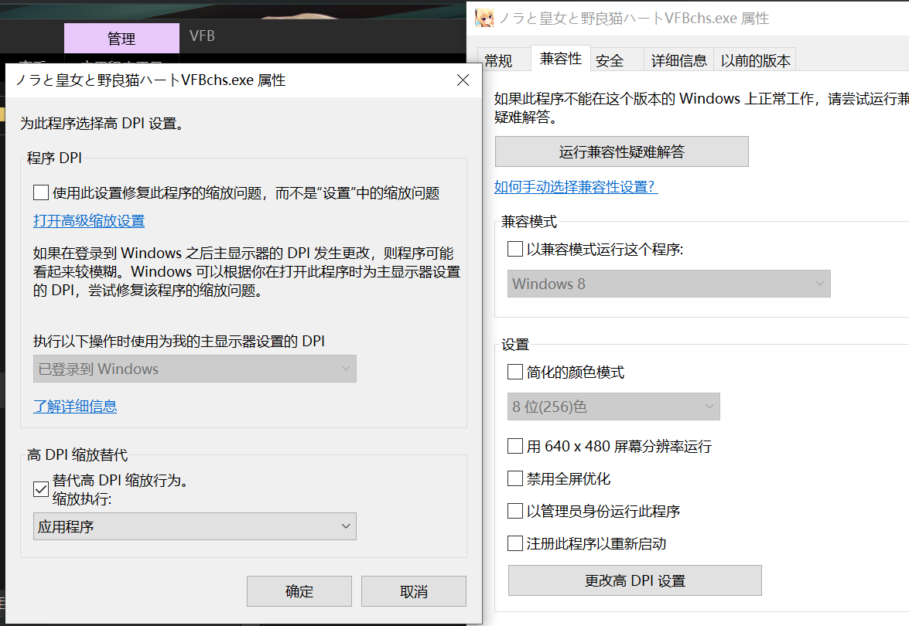
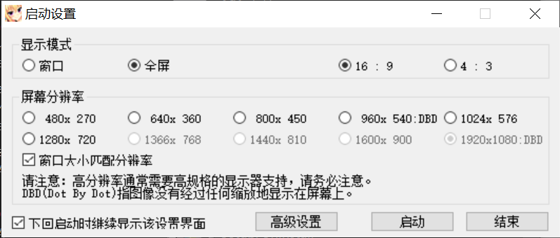
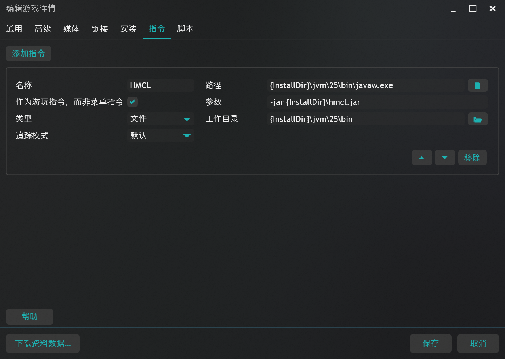
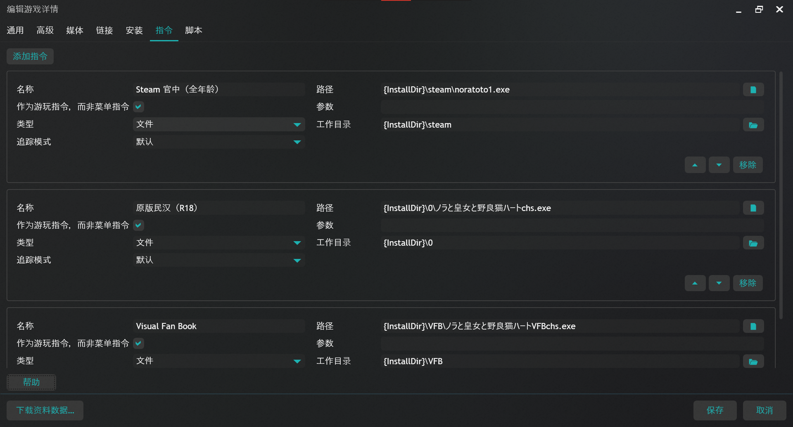
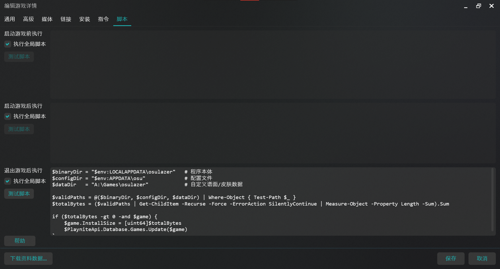
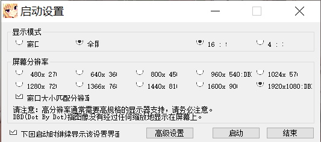

# 记一次“官中没有 R18”引发的惨案

> 本文包括：DPI、Playnite 单一实例多版本启动、powershell 配合 Playnite API 实现多目录游戏占用空间计算、Mojibake，以及自己玩 Galgame 的一些经验和感想。

《野良与皇女与流浪猫之心》，上个月刚满 10 周年。刚刚开始玩就吸引我了，画风好美丽呀，女主的身材都好完美呀，剧情好好玩，恋爱喜剧……

停停停，这不是 Galgame 读后感，何况我还没玩完呢。我已经忘了这个游戏是怎么刷到的了，可能是自己刷到的也可能是朋友推荐的（朋友推荐的那些游戏曾经都下载了但硬盘爆炸后我都没下回来。。），然后我去找资源的时候看到 steam 官中就下了。前几天室友问我欸你这是黄游吗🥀。欸这倒是提醒我了🦌，游戏前面正好有一段女子更衣室的剧情，但是游戏有圣光，我当时想藏得挺严哈，难道是要我过完线才能解锁隐藏内容吗？后面查了下资料，“PlayStation 移植版因为圣光过多而被批评，**但 steam 版本甚至是全年龄的**”。虽然我也不是说一定要玩 R18 内容，但是这也是剧情的一部分嘛，何况我已经感到部分内容有点跳跃了；后面重新下了民汉版本。

在我打算直接玩民汉版本前有一个小问题，就是原版的 DPI 在我电脑上有问题，具体来说，我的系统 DPI 缩放设置为 1.5x，部分软件无法正常处理。之前也遇到过类似情况：一款叫做 Rhythia 的音游在我的电脑上默认不能以 1080p 启动，解决方法是 exe 文件“属性”，“兼容性”-“更改高 DPI 设置”，“替代高 DPI 缩放行为”“缩放执行”用默认的“应用程序”（属性窗口中的“UAC 更改所有用户的设置”也可以）。

我在启动民汉版本及其 VFB 时碰到的窗口（也就是执行游戏 exe 后自动加载的 Setting.exe）如下图所示。注意到即使 1080p 标记为 DBD 也无法选中。我刚开始还未想到如何处理这个问题，我想的是万一原版只支持上一个 DBD 呢？然后 steam 实际上是 HD 重制版？而且当时我未注意到 R18 内容缺失对我的影响，于是我决定保留官中和民汉版本，平时玩用官中，玩完用全 cg 存档进民汉版本看看。

这就引出了第二个问题。我使用 Playnite 管理游戏，包括 osu! 和 hmcl，尤其是 Playnite 可以直接把 hmcl 所需的 jvm 启动命令写进启动指令里的功能深得我心（虽然快捷方式也能这样）（你问我为啥用 javaw.exe -jar 启动？因为 javaw 启动没有命令行窗口，和 pyw 一个道理）（你问我为啥要用命令行启动？因为 hcml 的 exe 需要环境变量里的 java，我这样可以指定非环境变量的 java）。

但是 Playnite 是针对单个实例的，用人话说就是一个 exe 一个游戏，想我这样想同时管理同一游戏的多种版本的情况，最简单的实践是创建多个实例。但在我查找官方使用文档后我找到了解决方法：启动指令是可以自定义的，就像 hmcl 那样；同时是可以多重的。所以就能实现同一实例多个游戏版本，而且如果各个版本在同一安装目录，还可以共用一个环境变量。

解决完这个问题后我又解决了另一个困扰我已久的问题：osu!lazer 虽然可以自定义文件路径，但只能自定义谱面、皮肤等“使用 osu! 后才会出现”的文件，本体仍然安装在 %LocalAppData%\osulazer\，缓存在 %AppData%\osu\（我想这是 ppy 为了兼容经典 osu! 而设计，或因为基于 .NET 而不想设计自定义安装目录的功能）（虽然可以用 mklink 链接文件到自定义文件的父目录，然后在 Playnite 中指定这个目录为安装目录，但 mklink 最好只用于没有应用程序的目录，形如 msi 安装包等对权限敏感的程序无法在 mklink 后的目录运行），对于只能定义单一路径为安装目录的 Playnite，无法正确统计游戏实际大小。我设计了一个简单的 powershell 脚本用于统计三个目录的总大小，结合 Playnite 的脚本执行功能和 Playnite API 实现每次游戏结束后自动统计 osu! 大小。

扯远了。进入民汉版本，才发现我错过了一个亿呀，原来这个 cg 里的女主的乳头是凹陷的呀😭，所以说 Galgame 看似是玩家扮演的男主刷女主好感，但这些福利 cg 实际上是女主在刷玩家好感呀，我不进线的话女主能拿我有什么办法。其他女主在个人线内强势反攻的剧情虽然好玩，但像 Marmalade 新作那种的不在少数。我本来都进女一号线了，啪一下就进行了一个选项的返回，不过玩着玩着发现之前玩官中估计错过了不止一个亿，所以打算从头玩了。浪费 5 小时 40 分钟。

在我彻底决定游玩民汉版本后，我尝试用之前解决 DPI 的方法修改了民汉版本游戏 exe 的属性，结果如下图所示，注意到分辨率很怪，但游戏确实可以以 1080p 启动。我也不再去想画面到底是软件缩放还是原生支持，能玩就行。

> 可以在 vndb 查最高支持分辨率。

## 题外话：Mojibake？

乱码。常在汉化游戏中出现。主要由以下几个原因造成：

1. 编码转换错误。绝大多数老牌 Galgame 引擎原生使用日本工业标准的 Shift-JIS 编码。中文 Windows（以及 wine）默认使用 GBK 或 GB2312 编码。当汉化补丁尝试在日文引擎上运行，或者汉文本在保存时没有正确转换为引擎能识别的编码时，计算机就会尝试用 GBK 的规则去读取 Shift-JIS 的二进制数据，或者反之。结果就是生成了一堆无意义的生僻汉字。

2. 字体映射丢失。这往往是因为汉化组修改了文本内容，但没有同时修改程序调用的字体文件。程序试图在一个只包含日文假名和常用日文汉字的字体库里，寻找中文特有的简体字。因为索引对不上，系统会随机抓取字体库中对应位置的字符来填充，导致乱码。

3. 悬停提示（Tooltip）或系统组件未汉化。如下图，注意到乱码出现在一个白色长条的悬停提示框中。很多汉化补丁只汉化了游戏脚本（对话、UI按钮），但忽略了系统底层的 Tooltip 文本。当鼠标悬停在按钮上时，系统尝试弹出原版的日文提示词。如果此时系统没有转区，系统就会直接用中文环境解码日文，造成局部乱码。

4. “乱码”本身可能就是汉化记号。在某些早期汉化技术中，会使用一种叫“编码欺骗”的手段。他们通过特定的映射表，把中文字符伪装成日文字符，让引擎误以为在读日文。如果看到这种文字出现在特定位置（如存档名或提示语），可能是因为汉化插件没能正确触发“反向翻译”。

解决方案：

1. 使用转区工具：尝试用 Locale Emulator 以“日文（日本）”环境运行游戏，看提示框是否变回正常的日文。Linux 中利用 Lutris 可以直接指定进程的运行语言环境，支持 wine。

2. 检查字体安装：确认汉化包里自带的字体已正确安装到系统中。

## 文：操作系统市场份额与 Galgame

我不禁在想，咱们这帮臭玩 Galgame 的之所以练就了一身“修电脑”的本领（好吧我只是爱折腾，可能大多数玩 Galgame 的都会日语/都买正版/能玩就行吧），本质上还是因为这个行业的底层架构太“念旧”了。

众所周知，Galgame 的核心阵地依然在日本本土，毕竟 ACG 文化就起源于日本。很多老牌厂商的引擎，代码和 Windows 一样堆叠得像层层叠叠的违章建筑，基石可能还是二十年前的某些闭源 API，虽然全球范围内 macOS、Linux（尤其是 steamDeck 后）的份额在逐年攀升，但在日本开发者眼里，只要 Windows 还能跑还能读取游戏光碟那就没必要折腾。

问题在于，跨平台已经不是选修课，而是救命药了。

目前的 Galgame 市场，尤其是那种传统的、依靠光碟分销的模式，疫情后萎缩得厉害，厂商们想要活下去，就必须拥抱 steam 或拥抱移动端（来吸引那些臭打游戏的和小学生）。这就是为什么我们看到很多新作开始抛弃那些祖传引擎，转向 Unity 或者相对简单 Ren'Py（虽然这些 Galgame 质量都……）。说到底，系统份额的变迁虽然不会直接让某个厂倒闭，但会倒逼技术革新。我真的很希望未来的 Galgame 市场不再是 Windows 独占，想象一下，未来不再需要折腾什么 Locale Emulator、wine、protonGE，不再需要去属性里勾选那个该死的 DPI，也不用担心官中和民汉版本因为编码冲突而打架。不管是通过 Web 技术实现的云端游玩，还是更加开放、原生的跨平台引擎，核心目的只有一个：**让好故事不再被技术门槛阻拦。**

毕竟，当女主在屏幕里对你真情流露时，谁也不想在这个时候弹出一个“师铊婉……”的乱码框，对吧？

希望在未来，我们能看到更多画风美丽、剧情扎实的作品，以更优雅、更现代的姿态出现在全平台上。

260320