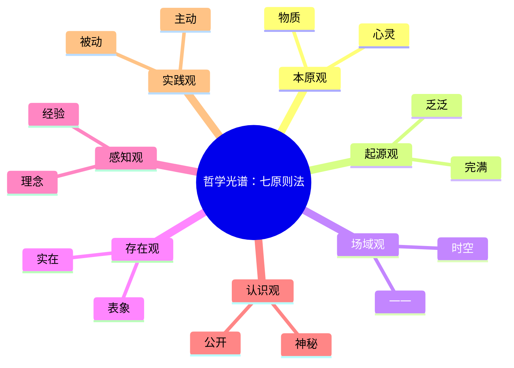
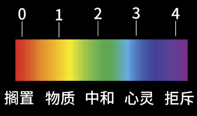
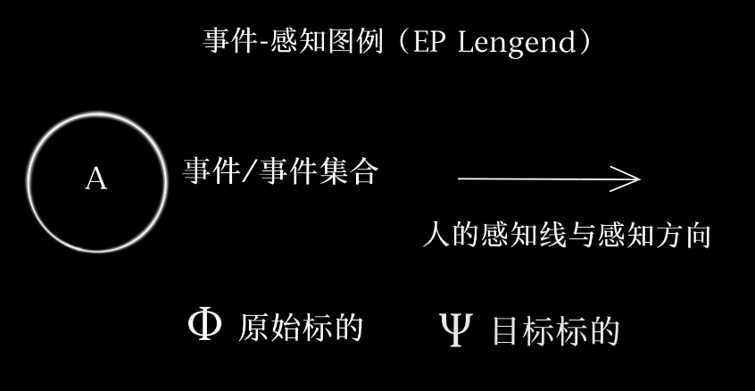
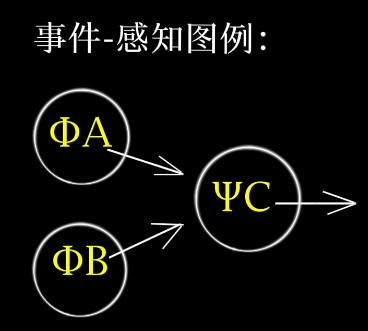
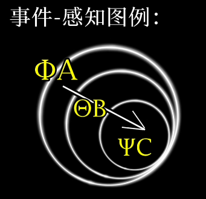
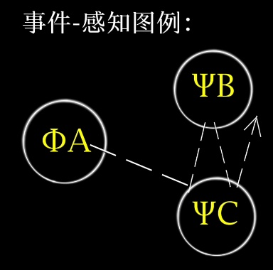
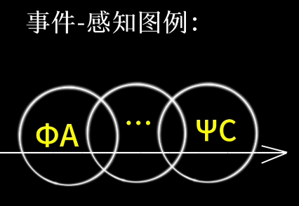
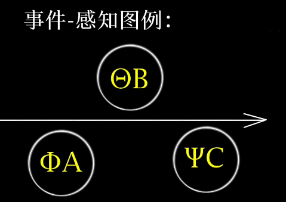

# 哲学光谱和五种事件逻辑

> 来源：[哲学光谱和五种事件逻辑 - 采樵野人](https://www.bilibili.com/video/BV1pZ17BiEad/)，笔者仅整理。

## 哲学光谱：七原则法

哲学是对一切现象有逻辑的阐发。

这是我们构建的哲学的七个维度，通过对这些维度的讨论，能够形成一个较为系统、完整的哲学主体。每个维度有两个倾向，通过这两个倾向，我们可以定位出 5 个数字节点。

我们所经历的一切过往哲学家的哲学都可以通过光谱的 5 个数字节点进行定位，通过截取某个哲学家不同维度的色相值可以组合出每个哲学家独特的光谱，并利用这七个维度的哲学光谱对于不同哲学体系进行总览性地概括。

## 事件逻辑

哲学光谱所表达的是现象的内容，而我们需要某些叙述逻辑将它们内在与外在进行串联，也就是我们要讲的事件逻辑。事件逻辑，是连结不同哲学主体内容的桥梁，和我们平常所讲的传统的逻辑不同，传统逻辑是必然的因果下的数理逻辑，主要讨论的是词相逻辑和命题逻辑，也就是我们平常讨论的全称与特称、肯定与否定的方阵组合、真值表等等。包括莱布尼茨、罗素、维根斯坦等人在构建逻辑时，他们所讨论的就是这一形式下的逻辑。

但我们今天要讨论的事件逻辑是在这一形式之上的逻辑，讨论的是能够与因果关系平等看待的逻辑。通俗来说，我们要回答的是：*我们在叙述事件时除了因果关系还可以有别的关系吗？*

我们将要重新定义形式之上的 5 种现实的事件关系，将过往逻辑重新扩大。我们引入“事件-感知”图例（EP Lengend）来方便理解。

圆圈代表事件或事件的集合，直线和箭头代表人的感知线和感知方向，$Φ$ 是事件的原始标的，$Ψ$ 是事件的目标标的。

这五种关系分别是：

### 因果关系

在图例中可以被表达为完备的原始事件 $a$ 和完备的原始事件 $b$ 同时决定了目标事件 $c$ 的发生。事件的引起与发生是紧密相连的，因果关系的事件逻辑意味着它的逻辑观是决定的；运动是因果的连环相扣。

因果关系认为存在的生成需要充足的理由律，包括三段论、充分必要的四种关系、模态命题，乃至哲学中的质量度，都是因果关系引导的逻辑叙述形式。

### 归置关系

在图例中可以被表达为目标事件 $c$ 内嵌于中间事件 $b$ 内嵌于原始事件 $a$。

归置关系认为后发事件早在原始事件存在时就已经出现，人的感知线和感知方向本质是内在的无限循环。归置关系与因果关系的不同是由于外延与内延所导致的逻辑结果的差异。

### 耦合关系

肯定原始事件与目标事件之间的非连续性与跳跃的可能。我们能确定的只是原始事件本征态的描述，也就是仅在原始事件 $K(ΦA)=0$ 的时候，A 仅如此被确定为可取的确定值。

人的感知线的虚线化反映了该感知背景下对对象的运行所具有的不确定性。因此，原始事件 $a$ 对目标事件 $b$ 和 $c$ 的行进并不具有必然性与彻底性。

耦合关系是粒子的量子性的逻辑化，挑战了现实中必然仅存绝对连续性的数理逻辑的公设。

### 介推关系

图例反映了原始事件 $a$ 与它的目标事件 $c$ 发生的不完备性是由于中介事件集合 $b$ 的不完全参与导致的，我们事实上只能推论原始事件和目标事件的相关性，但由于这种逻辑事实的确在发生，我们确然不能忽略这一逻辑关系，这种不完备性下的事件相关逻辑就是介推关系。

### 真存关系

指的是对原始事件 $a$ 和目标事件 $c$ 之间不施加必然的连续性或跳跃性的逻辑关系，仅承认它们互为真存的存在。

真存单位的坍塌不对其他真存单位存在因果上的影响，只针对存在本身而对其他存在产生影响；其他存在只是少了一个可以映射或反映的真存而已。

---

作为现实阐述的事件逻辑中我们无法取消感知线的存在，也无法消除现实感知对诸多事件的干扰因素。因此，在数理逻辑和推理中，我们有严格而必然的因果表达，但在我们所构建的这一现实的哲学体系中我们必须提出以上这些其他存在的逻辑叙述体例，把人们隐隐约约认为着的、我们似乎同时拥有的其他逻辑形式在哲学上提出来。

> “即便你知道你所感知中的所有细节，但你还需要知道一切在场者所感知的一切细节。”