# “强力-服从”模型

> 模型跳出以生产力-生产关系为社会发展依据的线性的史观，将文明发展分为三个纪元：史前纪元、文明纪元和后文明纪元，又将文明纪元分为四个阶段：高强力-高服从的“乌托邦”、高强力-低服从的“哥谭城”、低强力-高服从的“理念谷”和低强力-低服从的“诺曼山”。本文着重讨论文明纪元的四个阶段。

## 神明的惩罚，社会矛盾的根源

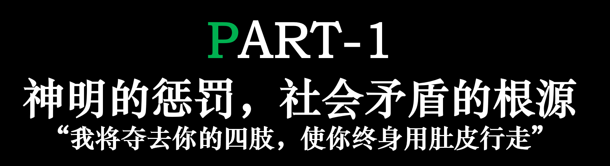

> “我将夺去你的四肢，使你终身用肚皮行走”

《圣经·旧约》“创世纪”篇记载，上帝在创造亚当和夏娃后，将他们安置在伊甸园中。上帝应允亚当享用园中的一切，唯独园当中树上的果子不得食用。阴险狡诈的蛇引诱夏娃吃了智慧之果，夏娃又引诱亚当吃了。当上帝光顾伊甸园时，祂发现亚当和夏娃躲在角落不敢出来。

原来，吃下智慧之果后，亚当和夏娃**拥有了辨明是非的能力**；他们意识到自己终日衣不蔽体，便觉羞愧，躲在角落不敢与上帝相见。

上帝震怒，驱逐亚当夏娃，又派两名天使把守伊甸园门口，以防止人类回到伊甸。倘若人又得到了树上的生命之果，便与上帝无异了。

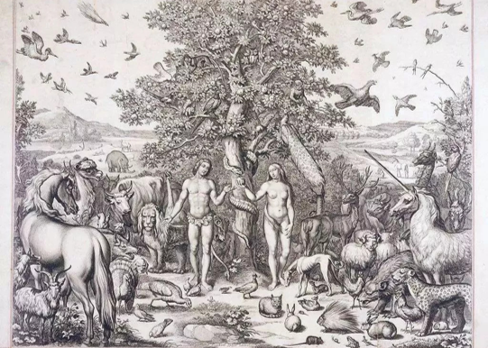

虽然这只是一个宗教神话，但是人类与其他生命的区别，就是拥有无与伦比的智慧。那么代价是什么？

中国古代就有“伯牙鼓琴”的故事，西方亦有毕加索和阿里亚斯的友谊情深。固然，这些故事令人为之动容，也令人扼腕叹息：大千世界，却难得觅得知音。

事实上，人类的“理解”，从所见、所听、所闻，到所思所想，**这一过程是不透明的**。人类思维的复杂性导致了它的不透明性。绝对的客观并不存在，因为语言等信息载体只能被人类的智慧本身理解。所谓客观不过是另一形式的主观。

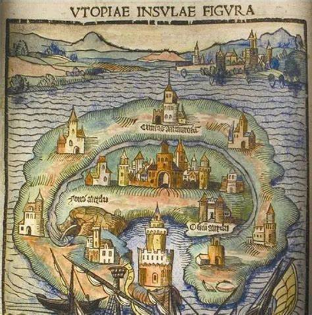

**人和人之间注定无法互相理解。这是一切社会矛盾的根源。**

人和人有不同的喜欢、宗教信仰、社会地位。有些是先天的性格决定的，更多的则是在社会影响下产生的。交流的目的根本不是理解。我们可以“理解”别人的意思，但是我们缺少他们的经历，因此不能设身处地地接受。

人的性格、公序良俗、道德规范，与社会秩序互相影响，又互相制约。人类社会发展至今已经走过了奴隶社会、封建社会、资本主义社会和社会主义社会。然而究其本质并没有任何变化：他们仍然遵从高强力-高服从的形态。

## 做哲学的主人，把哲学装进抽屉

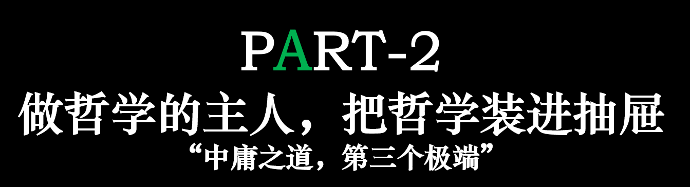

> “中庸之道，第三个极端”

什么是高强力-高服从形态？

在了解何为强力、何为服从，以及正式引入强力-服从二维社会形态坐标光谱之前，我将简述现有的一维、二维政治光谱。

所谓的一维光谱很简单，只有左右两个极端。对于“左”“右”的定义，各大学者也是众说纷纭。一般地，“左”指代追求平等，“右”指代追求自由。

二维光谱引入了“社会-个体”和“威权-民主”两个坐标轴。二维坐标光谱如此详尽，以至于几乎可以容纳历史上出现过的所有意识形态。

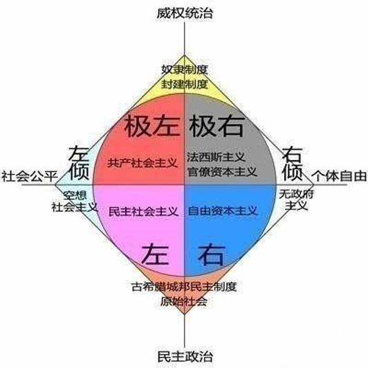

然而，正如前文所述，人类社会始终没有摆脱高强力-高服从的社会形态。强力-服从二维光谱，旨在从强力-服从这两个维度，深入剖析人类社会发展的可能性。

社会本质的构成要素是强力与服从，而非其他经济或生产要素，这是往日哲学家们常常迷失而难以克服的一点。社会的构成始于强立方与服从方的嵌合，缺少任意一方都不能形成社会。我们可以以此建立一个以强力为x轴，以服从为y轴的社会坐标系。那就可以推导出人类社会可能走向的四种终极形态。

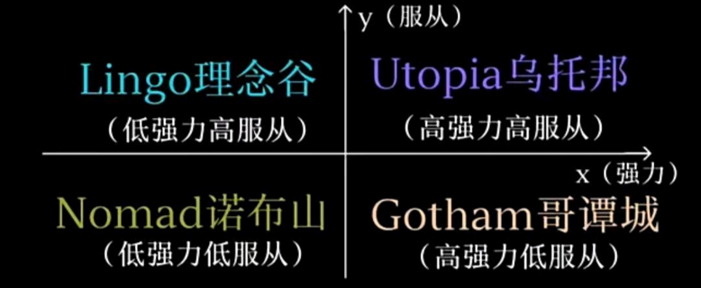

所谓强力，是一种抽象力，可以使他人折服；而服从，就是人们对于强力的普遍适应。奴隶社会的强力是奴隶主，服从的群体是奴隶；封建社会有皇帝和臣民；资本社会是资本家和劳动者；而最终极的高强力-高服从社会，则是国家（政府职能机构）和普通个人的服从关系。

这种社会形式称作**乌托邦（Utopia）**，然而它的最终形态却不会那么完美；相反，它应该是《1984》式的绝对强力和无法防抗的服从。

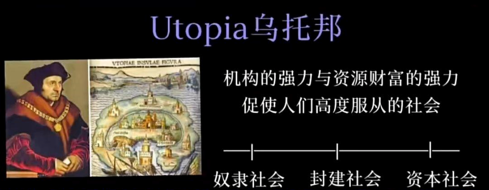

**理念谷（Lingo）** 取名自《老子》“邻国相望，鸡犬之声相闻，民至老死不相往来”的“邻国”。

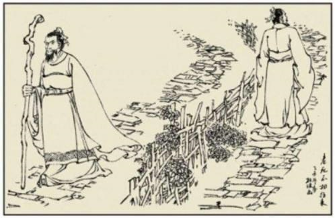

它是低强力-高服从的社会形态。理念谷重视人的三大自然权利：成为人的权力、爱护生命的权力、自主选择的权力。理念谷是人类智慧的制高点。它需要完善的生产力和隔绝人类社会的技术能力。

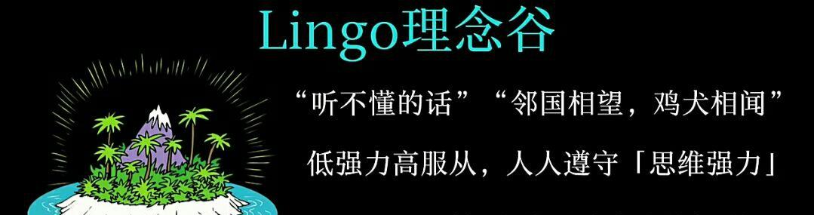

**诺布山（Nomad）** 本意是“游牧”，它是低强力-低服从的社会形态。诺布山重视自由的体验和游牧。在这个社会形态下，强力和服从都没有意义，人类的智慧将从矛盾的根源转化成幸福的根源。它和理念谷一样需要很高的生产力和技术力，并且要同时打破高强力的压迫和高服从的精神阉割。

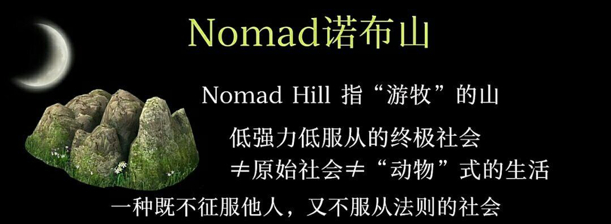

**哥谭城（Gotham）**，愚人小镇。人们信仰自己的强力却反对服从他人。这必然是一个动荡的社会形态，犯罪、迫害、战争、疾病将无处不在。这极有可能是乌托邦社会结束后的第二个基本形态。这将是人类历史上最惨痛的一段，却也是人类觉醒反抗，结束强力统治的第一步。

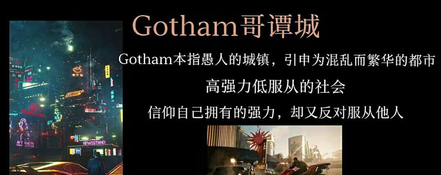

描述类似哥谭城的作品有很多，尤其是电子游戏《赛博朋克：2077》和影视作品《银翼杀手》。然而，虽然初见哥谭城的影子，它们的本质仍然是高服从的乌托邦社会。

## 伟大，在于前所未有的思考

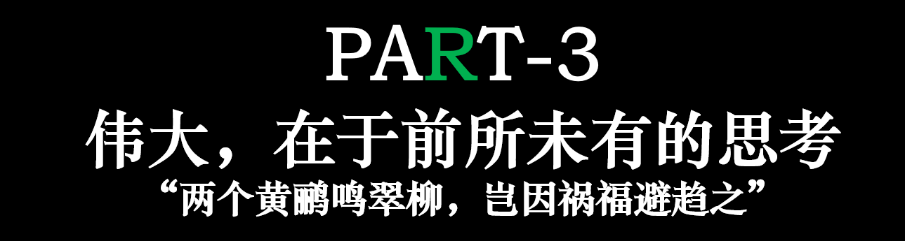

> “两个黄鹂鸣翠柳，岂因祸福避趋之”

人们的思考总是基于前人已有的知识和社会规范的潜移默化。

前人的经验固然重要，然而，若是不跳出“社会本质的构成要素是经济或生产要素”这一固有思维，便无法从强力与服从，而非其他经济或生产要素的角度去看待社会的发展；若是只读人文社科和数理化生，便不能在《圣经》这本宗教名著中窥见智慧对社会的深远影响

哲学是给人研究的，而不是给饭都吃不饱的牛马研究的。随着互联网的迅速发展，入网的学习成本不断降低，造就了一批又一批“网哲”。他们在现实受挫，回到互联网上自己的角落里和同伴交流可怜的经验，却不曾睁眼看看自己卡上不足五位数的余额。哲学固然能改变世界，但是**愚昧而不自知**亦有四大表现：

```
对从未见过之人恨之入骨；
对从未做过的事引以为傲；
对画而未得的饼感恩戴德；
对吹捧出来的神纳头就拜。
```

*日期丢失*

> *注：文章根据笔者制作的 ppt 复刻，ppt创建日期 240515*